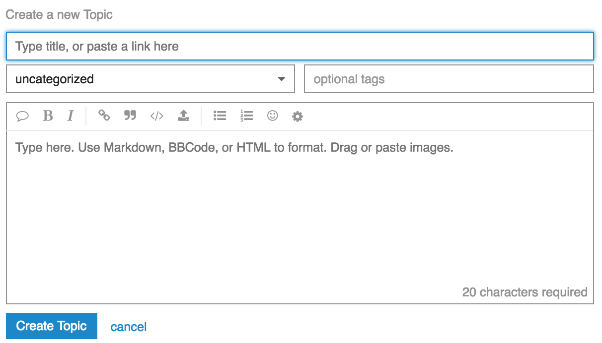

# discourse-characters-required

Shows how many characters a user has to input before their post is long enough
to go through.

## Installation

Follow our [Install a Plugin](https://meta.discourse.org/t/install-a-plugin/19157)
howto, using `git clone https://github.com/discourse/discourse-characters-required.git`
as the plugin command.

To enable, make sure the `characters required enabled` site setting is set to true.

## Contributing

Help make this plugin better by submitting a PR.  It's as easy as 1-2-3

* fork the repo
* create a feature branch
* rebase off master and send the pr

This project uses MIT-LICENSE.

## Issues

If you have issues or suggestions for the plugin, please bring them up on [Discourse Meta](https://meta.discourse.org).

